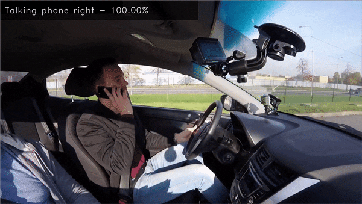

# Action Recognition Python\* Demo



This is the demo application for Action Recognition algorithm, which classifies actions that are being performed on input video.
The following pre-trained models are delivered with the product:
* `driver-action-recognition-adas-0002-encoder` + `driver-action-recognition-adas-0002-decoder`, which are models for driver monitoring scenario. They recognize actions like safe driving, talking to the phone and others
* `action-recognition-0001-encoder` + `action-recognition-0001-decoder` and `i3d-rgb-tf`, which are general-purpose action recognition (400 actions) models for Kinetics-400 dataset.

For more information about the pre-trained models, refer to the [intel models documentation](../../../models/intel/index.md) and [public models documentation](../../../models/public/index.md).

## How It Works

The demo pipeline consists of several frames, namely `Data`, `Model` and `Render`.
Every step implements `PipelineStep` interface by creating a class derived from `PipelineStep` base class. See `steps.py` for implementation details.

- `DataStep` reads frames from the input video.
-  Model step depends on model type:
    - For composite models there are two steps:
      -  `EncoderStep` preprocesses a frame and feeds it to the encoder model to produce a frame embedding.
      -  `DecoderStep` feeds embeddings produced by the `EncoderStep` to the decoder model and produces predictions.
    - For single model `SingleModelStep` does both preprocess and produce predictions.
- `RenderStep` renders prediction results.

Pipeline steps are composed in `AsyncPipeline`. Every step can be run in separate thread by adding it to the pipeline with `parallel=True` option.
When two consequent steps occur in separate threads, they communicate via message queue (for example, deliver step result or stop signal).

To ensure maximum performance, Inference Engine models are wrapped in `AsyncWrapper`
that uses Inference Engine async API by scheduling infer requests in cyclical order
(inference on every new input is started asynchronously, result of the longest working infer request is returned).
You can change the value of `num_requests` in `action_recognition_demo.py` to find an optimal number of parallel working infer requests for your inference accelerators
(Compute Sticks and GPUs benefit from higher number of infer requests).

> **NOTE**: By default, Open Model Zoo demos expect input with BGR channels order. If you trained your model to work with RGB order, you need to manually rearrange the default channels order in the demo application or reconvert your model using the Model Optimizer tool with `--reverse_input_channels` argument specified. For more information about the argument, refer to **When to Reverse Input Channels** section of [Converting a Model Using General Conversion Parameters](https://docs.openvinotoolkit.org/latest/_docs_MO_DG_prepare_model_convert_model_Converting_Model_General.html).

## Running

Running the application with the `-h` option yields the following usage message:

```
usage: action_recognition_demo.py [-h] -i INPUT [--loop] [-o OUTPUT]
                                  [-limit OUTPUT_LIMIT] -mt {single,composite}
                                  -m_en M_ENCODER
                                  [-m_de M_DECODER | --seq DECODER_SEQ_SIZE]
                                  [-l CPU_EXTENSION] [-d DEVICE] [-lb LABELS]
                                  [--no_show] [-s LABEL_SMOOTHING]
                                  [-u UTILIZATION_MONITORS]

Options:
  -h, --help            Show this help message and exit.
  -i INPUT, --input INPUT
                        Required. An input to process. The input must be a
                        single image, a folder of images, video file or camera
                        id.
  --loop                Optional. Enable reading the input in a loop.
  -o OUTPUT, --output OUTPUT
                        Optional. Name of output to save.
  -limit OUTPUT_LIMIT, --output_limit OUTPUT_LIMIT
                        Optional. Number of frames to store in output. If 0 is
                        set, all frames are stored.
  -mt {single,composite}, --model_type {single,composite}
                        Required. Specify model type.
  -m_en M_ENCODER, --m_encoder M_ENCODER
                        Required. Path to encoder model.
  -m_de M_DECODER, --m_decoder M_DECODER
                        Optional. Path to decoder model. If not specified, for
                        composite models simple averaging of encoder's outputs
                        over a time window is applied.
  --seq DECODER_SEQ_SIZE
                        Optional. Length of sequence that decoder takes as
                        input.
  -l CPU_EXTENSION, --cpu_extension CPU_EXTENSION
                        Optional. For CPU custom layers, if any. Absolute path
                        to a shared library with the kernels implementation.
  -d DEVICE, --device DEVICE
                        Optional. Specify a target device to infer on. CPU,
                        GPU, FPGA, HDDL or MYRIAD is acceptable. The demo will
                        look for a suitable plugin for the device specified.
                        Default value is CPU.
  -lb LABELS, --labels LABELS
                        Optional. Path to file with label names.
  --no_show             Optional. Don't show output.
  -s LABEL_SMOOTHING, --smooth LABEL_SMOOTHING
                        Optional. Number of frames used for output label
                        smoothing.
  -u UTILIZATION_MONITORS, --utilization-monitors UTILIZATION_MONITORS
                        Optional. List of monitors to show initially.
```

Running the application with an empty list of options yields the usage message given above and an error message.

To run the demo, you can use public or pre-trained models. To download the pre-trained models, use the OpenVINO [Model Downloader](../../../tools/downloader/README.md). The list of models supported by the demo is in [models.lst](./models.lst).

> **NOTE**: Before running the demo with a trained model, make sure the model is converted to the Inference Engine format (\*.xml + \*.bin) using the [Model Optimizer tool](https://docs.openvinotoolkit.org/latest/_docs_MO_DG_Deep_Learning_Model_Optimizer_DevGuide.html).

**For example**, to run the demo for in-cabin driver monitoring scenario, please provide a path to the encoder and decoder models, an input video and a file with label names:
```bash
python3 action_recognition_demo.py -mt composite -m_en models/driver_action_recognition_tsd_0002_encoder.xml \
    -m_de models/driver_action_recognition_tsd_0002_decoder.xml \
    -i <path_to_video>/inputVideo.mp4 \
    -lb driver_actions.txt
```

## Demo Output

The application uses OpenCV to display the real-time results and current inference performance (in FPS).

## See Also
* [Using Open Model Zoo demos](../../README.md)
* [Model Optimizer](https://docs.openvinotoolkit.org/latest/_docs_MO_DG_Deep_Learning_Model_Optimizer_DevGuide.html)
* [Model Downloader](../../../tools/downloader/README.md)
