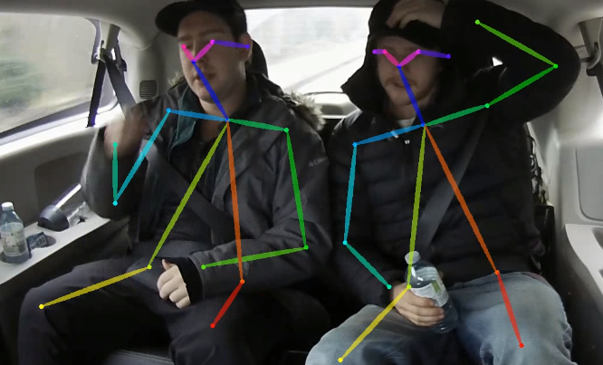

# human-pose-estimation-0005

## Use Case and High-Level Description

This is a multi-person 2D pose estimation network based on the EfficientHRNet approach (that follows the Associative Embedding framework).
For every person in an image, the network detects a human pose: a body skeleton consisting of keypoints and connections between them.
The pose may contain up to 17 keypoints: ears, eyes, nose, shoulders, elbows, wrists, hips, knees, and ankles.

## Example

## Specification

| Metric                          | Value                                     |
|---------------------------------|-------------------------------------------|
| Average Precision (AP)          | 45.6%                                     |
| GFlops                          | 5.9206                                    |
| MParams                         | 8.1506                                    |
| Source framework                | PyTorch\*                                 |

Average Precision metric described in [COCO Keypoint Evaluation site](https://cocodataset.org/#keypoints-eval).

## Inputs

Image, name: `input`, shape: `1, 3, 288, 288` in the `B, C, H, W` format, where:

- `B` - batch size
- `C` - number of channels
- `H` - image height
- `W` - image width

Expected color order is `BGR`.

## Outputs

The net outputs are two blobs:

1. `heatmaps` of shape `1, 17, 144, 144` containing location heatmaps for keypoints of all types. Locations that are filtered out by non-maximum suppression algorithm have negated values assigned to them.
2. `embeddings` of shape `1, 17, 144, 144, 1` containing associative embedding values, which are used for grouping individual keypoints into poses.

## Legal Information
[*] Other names and brands may be claimed as the property of others.
